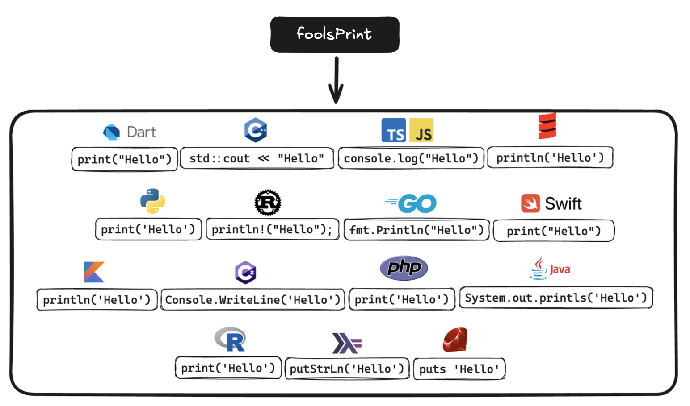

# FoolScript Snippets

               

<!-- This is a comment

https://shields.io/

https://simpleicons.org/

https://javascript.plainenglish.io/how-to-make-custom-language-badges-for-your-profile-using-shields-io-d2aeaf016b6b

-->

At [FoolScript](https://foolscript.com) our mission is to help you code like a Fool in every programming language. We create tools and resources t

## Snippets

This extension provides a large list of generic snippets that can be used in any project, regardless of the language used.

How does it work?

Each snippet is implemented separately in each language. This means that if you are working in a TypeScript file, you will get TypeScript-specific snippets. If you are working in a Rust file, you will get Rust-specific snippets. This allows you to use the same snippet prefix in different languages and get the correct snippet for the language you are working in.

Check out the [official docs](https://foolscript.com/) for more information.

## Supported Languages

| Language | File Extensions | VS Code Extension |
| -------- | --------------- | ----------------- |
| [Dart](https://dart.dev/) | `.dart` | [Dart Code](https://marketplace.visualstudio.com/items?itemName=Dart-Code.dart-code) |
| [Swift](https://www.swift.org/) | `.swift` | [Swift Language](https://marketplace.visualstudio.com/items?itemName=Kasik96.swift) |
| [JavaScript](https://www.javascript.com/) | `.js` | Built-in |
| [JavaScript React (JSX)](https://react.dev/) | `.jsx` | [VSCode React Refactor](https://marketplace.visualstudio.com/items?itemName=planbcoding.vscode-react-refactor) |
| [TypeScript](https://www.typescriptlang.org/) | `.ts` | Built-in |
| [TypeScript React (TSX)](https://react.dev/learn/typescript) | `.tsx` | [TypeScript TSLint Plugin](https://marketplace.visualstudio.com/items?itemName=ms-vscode.vscode-typescript-tslint-plugin) |
| [Go](https://go.dev/) | `.go` | [Go](https://marketplace.visualstudio.com/items?itemName=golang.Go) |
| [Rust](https://www.rust-lang.org/) | `.rs`, `.rlib` | [Rust](https://marketplace.visualstudio.com/items?itemName=rust-lang.rust) |
| [Kotlin](https://kotlinlang.org/) | `.kt`, `.kts` | [Kotlin](https://marketplace.visualstudio.com/items?itemName=fwcd.kotlin) |
| [Python](https://www.python.org/) | `.py` | [Python](https://marketplace.visualstudio.com/items?itemName=ms-python.python) |
| [C++](https://cplusplus.com/) | `.cpp`, `.hpp`, `.cc`, `.hh`, `.cxx`, `.hxx`, `.c++`, `.h++` | [C/C++](https://marketplace.visualstudio.com/items?itemName=ms-vscode.cpptools) |
| [C#](https://dotnet.microsoft.com/en-us/languages/csharp) | `.cs` | [C#](https://marketplace.visualstudio.com/items?itemName=ms-dotnettools.csharp) |
| [Java](https://docs.oracle.com/javase/8/docs/technotes/guides/language/index.html) | `.java` | [Language Support for Java(TM) by Red Hat](https://marketplace.visualstudio.com/items?itemName=redhat.java) |
| [PHP](https://www.php.net/) | `.php` | [PHP Intelephense](https://marketplace.visualstudio.com/items?itemName=bmewburn.vscode-intelephense-client) |
| [Ruby](https://www.ruby-lang.org/en/) | `.rb` | [Ruby](https://marketplace.visualstudio.com/items?itemName=rebornix.Ruby) |
| [R](https://www.r-project.org/) | `.r` | [R](https://marketplace.visualstudio.com/items?itemName=Ikuyadeu.r) |
| [Scala](https://www.scala-lang.org/) | `.scala`, `.sc` | [Scala (Metals)](https://marketplace.visualstudio.com/items?itemName=scalameta.metals) |
| [Markdown](https://www.markdownguide.org/) | `.md` | Built-in |
| [Haskell](https://www.haskell.org/) | `.hs` | [Haskell Syntax Highlighting](https://marketplace.visualstudio.com/items?itemName=haskell.haskell) |
| [PowerShell](https://docs.microsoft.com/en-us/powershell/) | `.ps1` | [PowerShell](https://marketplace.visualstudio.com/items?itemName=ms-vscode.PowerShell) |
| [Perl](https://www.perl.org/) | `.pl` | [Perl](https://marketplace.visualstudio.com/items?itemName=henriiik.vscode-perl) |

## Snippets

Each snippet has multiple aliases but you can see them all by typing the "fools" prefix. Aliases are written in plain english and are easy to remember. For example, the `foolsPrint` snippet can be accessed by typing "foolsPrint", "print", "log", "out", and "write".

| Name                  | Description                                                               |
| --------------------- | ------------------------------------------------------------------------- |
| foolsInfo              | Outputs information about the language                                    |
| foolsStructure         | Outputs the basic structure for a project                                 |
| foolsOperators         | Outputs the basic operators for the language                              |
| foolsOperatorsBool  | Outputs the basic boolean operators for the language                      |
| foolsEqual             | Outputs the equality operator for the language                            |
| foolsNotEqual          | Outputs the not equal operator for the language                           |
| foolsEntry             | Creates a main entry point                                                |
| foolsTypeCheck         | Outputs the basic syntax for type checking                                |
| foolsTypeCompare       | Outputs the basic syntax for type comparison                              |
| foolsTypeConvert       | Outputs the basic syntax for type conversion                              |
| foolsTypes             | The language's data types                                                 |
| foolsTypesString       | The language's string data type                                           |
| foolsTypesInt          | The language's integer data type                                          |
| foolsTypesNum          | The language's numerical data type                                        |
| foolsTypesBool         | The language's boolean data type                                          |
| foolsTypesBoolTrue     | The language's value for true                                             |
| foolsTypesBoolFalse    | The language's value for false                                            |
| foolsTypesDate         | The language's Date data type                                             |
| foolsTypesList         | The language's list data type                                             |
| foolsTypesMap          | The language's map data type                                              |
| foolsTypesDynamic      | The language's dynamic data type                                          |
| foolsTypesNull         | The language's nullable data type                                         |
| foolsNow               | How the language represents the current time                              |
| foolsVar               | Creates a variable                                                        |
| foolsVarSyntax         | Outputs the basic syntax for a variable                                   |
| foolsVarTyped          | Creates a statically typed variable                                       |
| foolsVarNullable       | Creates a nullable variable                                               |
| foolsVarString         | Creates a string variable                                                 |
| foolsVarStringMulti    | Creates a multi-line string variable                                      |
| foolsVarNum            | Creates a number variable                                                 |
| foolsVarBool           | Creates a boolean variable                                                |
| foolsVarDate           | Creates a date variable                                                   |
| foolsVarList           | Creates a list variable                                                   |
| foolsVarMap            | Creates a map variable                                                    |
| foolsConst             | Creates a constant variable                                               |
| foolsVarStatic         | Creates a static variable                                                 |
| foolsGenMap            | Generates a map/dictionary with a specific number of key/value pairs      |
| foolsGenList           | Generates a list/array of a specific length                               |
| foolsPrint             | Creates a print/log statement                                             |
| foolsPrintMulti        | Creates a multi-line print/log statement                                  |
| foolsInterpolate       | Interpolates a string                                                     |
| foolsConcat            | Concatenates a string                                                     |
| foolsForLoop           | Creates a for loop                                                        |
| foolsForIn             | Creates a for-in/of loop                                                  |
| foolsWhileLoop         | Creates a while loop                                                      |
| foolsSwitch            | Creates a switch stament with default                                     |
| foolsFunc              | Creates a function                                                        |
| foolsFuncArgs          | Creates a function with arguments                                         |
| foolsFuncArgsNamed     | Creates a function with named arguments                                   |
| foolsFuncArrow         | Creates an arrow function                                                 |
| foolsFuncAnon          | Creates an anonymous function                                             |
| foolsFuncLambda        | Creates a lambda function                                                 |
| foolsFuncSyntax        | Outputs the basic syntax for a function                                   |
| foolsComment           | Creates a single-line comment                                             |
| foolsCommentMulti      | Creates a multi-line comment                                              |
| foolsThrow             | Throws an exception                                                       |
| foolsTryCatch          | Creates a try-catch block                                                 |
| foolsIf                | Creates an if statement                                                   |
| foolsIfElse            | Creates an if-else statement                                              |
| foolsTernary           | Creates a ternary statement                                               |

> If a language does not support the snippet, a comment will be added to the file indicating that the snippet is not supported. Additional resources may also be provided.
